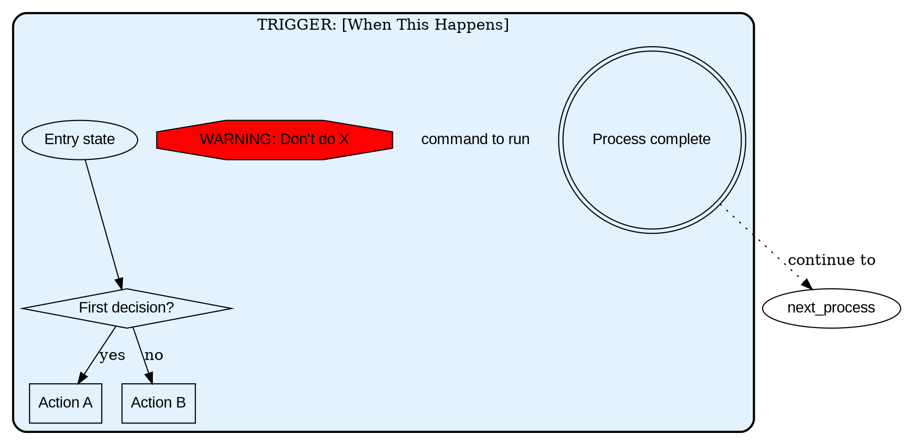

# Claude Process Library Index

**Purpose**: Quick reference guide for finding the right process workflow for any situation.

**How to Use**:
1. Identify your trigger (current situation)
2. Find the corresponding `.dot` file
3. Follow the process mechanically

---

## Quick Reference Table

| Trigger | File | When to Use | Priority |
|---------|------|-------------|----------|
| **Starting new feature/task** | [new-feature-implementation.dot](development/new-feature-implementation.dot) | New request arrives, feature spec ready | P0 |
| **Before marking work complete** | [completion-checklist.dot](development/completion-checklist.dot) | Feature done, ready for review/merge | P0 |
| **Need to validate code** | [analyzer-usage-decision.dot](development/analyzer-usage-decision.dot) | Deciding Analyzer vs manual validation | P0 |
| **Deciding on state management** | [fsm-decision-matrix.dot](development/fsm-decision-matrix.dot) | Considering FSM vs simple if/else | P0 |
| **TypeScript compilation errors** | [typescript-error-fixing.dot](development/typescript-error-fixing.dot) | TypeScript errors detected, need systematic fixing | P0 |
| **I'm stuck/confused** | [when-stuck.dot](development/when-stuck.dot) | After 3 failed attempts, same error >30min | P0 |
| **Before deploying to production** | [pre-deployment-verification.dot](deployment/pre-deployment-verification.dot) | Ready to deploy, all dev complete | P0 |
| **Database schema changes** | [database-migration.dot](deployment/database-migration.dot) | Migrations to apply | P0 |
| **Critical issues in production** | [rollback-procedure.dot](deployment/rollback-procedure.dot) | Error rate >5%, data corruption, security breach | P0 |
| **After deployment completes** | [post-deployment-verification.dot](deployment/post-deployment-verification.dot) | Verify system health | P0 |
| **Deploying to Kubernetes** | [kubernetes-deployment.dot](deployment/kubernetes-deployment.dot) | Container ready, K8s cluster configured | P1 |
| **Production security setup** | [security-setup.dot](security/security-setup.dot) | New deployment, security audit | P0 |
| **Security incident detected** | [incident-response.dot](security/incident-response.dot) | Unauthorized access, data breach, vulnerability exploit | P0 |
| **Starting DSPy optimization** | [dspy-training-workflow.dot](development/dspy-training-workflow.dot) | Agent needs optimization, have 5-10+ examples | P1 |
| **DSPy training failed** | [dspy-troubleshooting.dot](development/dspy-troubleshooting.dot) | Training crashes, poor results, no improvement | P1 |
| **Reviewing implementation plan** | [plan-v8-final.dot](planning/plan-v8-final.dot) | 26-week timeline review | P1 |
| **Reviewing Week 18 progress** | [plan-v8-updated.dot](planning/plan-v8-updated.dot) | 69.2% complete status | P1 |
| **Reviewing technical spec** | [spec-v8-final.dot](technical/spec-v8-final.dot) | 9 UI pages + audit system | P1 |
| **Reviewing agent API** | [agent-api-reference.dot](technical/agent-api-reference.dot) | 24 task types across 6 agents | P1 |
| **Reviewing DSPy datasets** | [drone-to-princess-datasets-summary.dot](technical/drone-to-princess-datasets-summary.dot) | Princess delegation training | P1 |
| **Reviewing Princess delegation** | [princess-delegation-guide.dot](workflow/princess-delegation-guide.dot) | 28 agent routing guide | P1 |
| **Week 26 production launch** | [week26-production-launch.dot](deployment/week26-production-launch.dot) | Complete production launch workflow | P0 |
| **Deployment readiness check** | [deployment-readiness-checklist.dot](deployment/deployment-readiness-checklist.dot) | Systematic deployment validation | P0 |
| **Understanding Claude Code backend** | [claude-code-backend-integration.dot](workflow/claude-code-backend-integration.dot) | How THIS instance acts as Queen | P0 |
| **Reviewing executive summary** | [executive-summary-v8-final.dot](strategic/executive-summary-v8-final.dot) | Strategic overview + GO/NO-GO | P1 |
| **Reviewing Week 18 strategic status** | [executive-summary-v8-updated.dot](strategic/executive-summary-v8-updated.dot) | Week 18 GO decision | P1 |
| **Reviewing agent instructions** | [agent-instruction-system.dot](quality/agent-instruction-system.dot) | 26 prompt engineering principles | P1 |
| **Using Claude Code Web** | [claude-code-web-workflow.dot](platform/claude-code-web-workflow.dot) | Web interface workflow, PR creation | P0 |
| **Configuring sandbox security** | [sandbox-configuration-guide.dot](platform/sandbox-configuration-guide.dot) | Security isolation setup | P0 |
| **Moving sessions between platforms** | [session-teleportation-workflow.dot](platform/session-teleportation-workflow.dot) | Web ↔ CLI session transfer | P1 |
| **Using interactive questions** | [interactive-questioning-workflow.dot](platform/interactive-questioning-workflow.dot) | Clarification and planning | P1 |
| **Understanding Claude Code features** | [claude-code-capabilities-overview.dot](platform/claude-code-capabilities-overview.dot) | Platform capabilities reference | P1 |

---

## Process Relationships

```
┌─────────────────────────────────────────────────────────────┐
│                  DEPLOYMENT WORKFLOW                         │
└─────────────────────────────────────────────────────────────┘
    │
    ├─> Pre-Deployment Verification
    │   ├─> Database Migration (if needed)
    │   └─> Security Setup
    │
    ├─> Kubernetes Deployment
    │
    ├─> Post-Deployment Verification
    │   └─> Rollback Procedure (if issues)
    │
    └─> Monitoring (24 hours)

┌─────────────────────────────────────────────────────────────┐
│                  SECURITY WORKFLOW                           │
└─────────────────────────────────────────────────────────────┘
    │
    ├─> Security Setup (pre-deployment)
    │
    ├─> Incident Response (if triggered)
    │
    └─> Post-Incident Review

┌─────────────────────────────────────────────────────────────┐
│                  DSPY OPTIMIZATION WORKFLOW                  │
└─────────────────────────────────────────────────────────────┘
    │
    ├─> DSPy Training Workflow
    │   ├─> Phase 0: Planning (CRITICAL)
    │   ├─> Phase 1: Setup
    │   ├─> Phase 2: Implementation
    │   ├─> Phase 3: Training
    │   └─> Phase 4: Validation
    │
    └─> DSPy Troubleshooting (if needed)

┌─────────────────────────────────────────────────────────────┐
│                  DEVELOPMENT WORKFLOW                        │
└─────────────────────────────────────────────────────────────┘
    │
    ├─> New Feature Implementation (TDD cycle)
    │   ├─> Comprehension Check
    │   ├─> Context Gathering
    │   ├─> Test-First Development
    │   └─> Completion Checklist
    │
    ├─> Decision Workflows
    │   ├─> Analyzer Usage Decision (legacy vs new code)
    │   └─> FSM Decision Matrix (≥3 criteria required)
    │
    └─> When Stuck (any time - 3-strikes escalation)
```

---

## Process Categories

### 🚀 Deployment Processes (7 processes)
- **pre-deployment-verification.dot**: Validate readiness before deployment
- **database-migration.dot**: Apply schema changes with rollback capability
- **kubernetes-deployment.dot**: Deploy containerized app to K8s
- **post-deployment-verification.dot**: Verify system health after deployment
- **rollback-procedure.dot**: Emergency rollback for critical issues
- **week26-production-launch.dot**: Complete Week 26 production launch workflow with manual testing
- **deployment-readiness-checklist.dot**: Systematic deployment validation (all checks before production)

### 🛡️ Security Processes (2 processes)
- **security-setup.dot**: Configure production security (headers, TLS, secrets, etc.)
- **incident-response.dot**: Handle security incidents (detection → containment → recovery)

### 💻 Development Processes (8 processes)
- **new-feature-implementation.dot**: Complete TDD workflow for new features (comprehension → context → test-first → commit)
- **completion-checklist.dot**: Quality gates before marking work complete (tests → build → NASA compliance → documentation)
- **analyzer-usage-decision.dot**: Decision workflow for Analyzer vs manual validation (legacy vs new code paths)
- **fsm-decision-matrix.dot**: FSM justification with governance validation (≥3 of 5 criteria + Constitution alignment)
- **typescript-error-fixing.dot**: Systematic TypeScript error resolution (triage → categorize → fix → verify → document)
- **when-stuck.dot**: Escalation path when stuck (3-strikes rule)
- **dspy-training-workflow.dot**: Complete DSPy agent optimization workflow (Phase 0-4)
- **dspy-troubleshooting.dot**: Debug DSPy training issues and failures

### 📋 Planning Processes (2 processes)
- **plan-v8-final.dot**: 26-week implementation timeline with critical gates (Weeks 1-26)
- **plan-v8-updated.dot**: Week 18 progress update (69.2% complete, 30,658 LOC delivered)

### 📊 Strategic Processes (2 processes)
- **executive-summary-v8-final.dot**: Strategic overview with 88% confidence GO/NO-GO decision
- **executive-summary-v8-updated.dot**: Week 18 strategic status with 95% confidence GO decision

### 🔧 Technical Processes (3 processes)
- **spec-v8-final.dot**: Complete technical specification (9 UI pages + 3-stage audit system)
- **agent-api-reference.dot**: API reference for 24 task types across 6 agents
- **drone-to-princess-datasets-summary.dot**: DSPy training datasets for Princess delegation

### 🔄 Workflow Processes (2 processes)
- **princess-delegation-guide.dot**: Complete routing guide for 28 agents across 3 Princesses
- **claude-code-backend-integration.dot**: Understanding how THIS Claude Code instance acts as Queen agent (Week 26)

### ✨ Quality Processes (1 process)
- **agent-instruction-system.dot**: 26 prompt engineering principles embedded in agent system

### 🌐 Platform Processes (5 processes)
- **claude-code-capabilities-overview.dot**: Complete reference of Claude Code features (CLI, Web, VS Code, iOS, Sandbox, etc.)
- **claude-code-web-workflow.dot**: Using Claude Code Web (claude.ai/code) with environment setup, PR creation, and teleportation
- **sandbox-configuration-guide.dot**: Security sandbox configuration with file/network/command isolation
- **session-teleportation-workflow.dot**: Moving sessions between Web and CLI with context preservation
- **interactive-questioning-workflow.dot**: Using the interactive question tool for clarification and planning

---

## How to Read a Process File

### Node Shapes & Meanings

| Shape | Meaning | Example |
|-------|---------|---------|
| **Ellipse** `[shape=ellipse]` | Entry point (current state) | `"I'm stuck"` |
| **Diamond** `[shape=diamond]` | Decision/Question | `"Test passes?"` |
| **Box** `[shape=box]` | Action to take | `"Write the test"` |
| **Plaintext** `[shape=plaintext]` | Literal command (copy-paste) | `"npm test"` |
| **Octagon** `[shape=octagon]` | Critical warning/stop | `"NEVER skip tests"` |
| **Doublecircle** `[shape=doublecircle]` | Exit point (process complete) | `"Deployment complete"` |

### Edge Styles

| Style | Meaning | Example |
|-------|---------|---------|
| **Solid arrow** `->` | Normal flow within process | `"Test" -> "Deploy"` |
| **Dotted arrow** `[style=dotted]` | Jump to another process | `"Failed" -> debug_process` |
| **Labeled edge** `[label="yes"]` | Conditional flow | `"Passes?" -> "Deploy" [label="yes"]` |

### Color Conventions

| Color | Meaning |
|-------|---------|
| **Red** `fillcolor=red` | Critical warning/failure |
| **Orange** `fillcolor=orange` | Important checkpoint/escalation |
| **Yellow** `fillcolor=yellow` | Caution/note |
| **Light green** `fillcolor=lightgreen` | Success/completion |
| **Light blue** `fillcolor=lightblue` | Normal process |

---

## Usage Examples

### Example 1: "I need to deploy to production"

**Step 1**: Identify trigger → "Before deploying to production"

**Step 2**: Load process → `pre-deployment-verification.dot`

**Step 3**: Follow mechanically:
1. Start at entry node: "Deployment requested"
2. Execute: `git status`
3. Execute: `git log -1`
4. Decision: "All CI/CD checks passing?"
   - If yes → continue
   - If no → "Fix CI/CD failures"
5. Continue following arrows until "Ready to deploy"

**Step 4**: Follow cross-process link → `deployment-execution` (next process)

---

### Example 2: "DSPy training crashed"

**Step 1**: Identify trigger → "DSPy training failed"

**Step 2**: Load process → `dspy-troubleshooting.dot`

**Step 3**: Follow mechanically:
1. Start at: "DSPy issue encountered"
2. Decision: "What type of issue?" → "crash"
3. Route to: "Training crashes"
4. Decision: "Check: Missing .with_inputs()?"
5. Follow fix steps
6. Exit at: "Issue resolved" or "ESCALATE: Ask for help"

**Step 4**: If resolved → Return to `dspy-training-workflow.dot`

---

### Example 3: "I'm stuck on a bug"

**Step 1**: Identify trigger → "I'm stuck/confused"

**Step 2**: Load process → `when-stuck.dot`

**Step 3**: Follow mechanically:
1. Start at: "I'm stuck"
2. Execute: Write down problem, attempts, expected/actual
3. Decision: "Third attempt failed?"
   - If yes → "Tell user explicitly: 'I don't understand X'"
   - If no → "Try simplification"
4. Follow debugging techniques
5. Loop back if still stuck

---

## Adding New Processes

### When to Create a New Process

**✅ DO create a process when**:
- Same situation occurs 3+ times
- Clear trigger condition exists
- Pattern is generalizable
- Would help others (not just one-off)

**❌ DON'T create a process when**:
- Only happened once
- Too vague to be actionable ("Handle edge cases")
- Too specific to one codebase ("Fix login bug in Project X")
- Would make things more complex

### Process Template



---

## Testing a Process

### Dry Run Method

1. **Follow it literally**: Pretend you're a robot. Can you execute each step?

2. **Check for vagueness**:
   - ❌ "Fix the issue" → ✅ "Run git diff to see changes"
   - ❌ "Handle the error" → ✅ "Wrap in try-catch and log to console"

3. **Verify all branches covered**:
   ```dot
   "Test passes?" [shape=diamond];
   "Test passes?" -> "Commit" [label="yes"];
   "Test passes?" -> "???" [label="no"];  // Missing! Add debug process
   ```

4. **Check trigger clarity**: Would you know when to use this process?
   - ❌ "Code quality process" (when would I use this?)
   - ✅ "TRIGGER: Before marking work complete" (crystal clear)

---

## Rendering Process Diagrams

### Using Graphviz

```bash
# Install Graphviz
# Ubuntu/Debian: sudo apt install graphviz
# macOS: brew install graphviz
# Windows: choco install graphviz

# Render to PNG
dot -Tpng deployment/pre-deployment-verification.dot -o pre-deployment.png

# Render to SVG (scalable)
dot -Tsvg security/incident-response.dot -o incident-response.svg

# Render all processes
for file in **/*.dot; do
    dot -Tpng "$file" -o "${file%.dot}.png"
done
```

### Using VS Code Extension

Install: **Graphviz (dot) language support for Visual Studio Code**

- Preview: Right-click `.dot` file → "Open Preview"
- Export: Right-click preview → "Export" → Choose format

---

## Process Maintenance

### Updating Existing Processes

**When process isn't working**:
1. Identify where you got stuck
2. Determine issue type:
   - Missing decision point → Add diamond with branches
   - Unclear instructions → Clarify node text
   - Wrong trigger → Fix trigger name in label
3. Test by following again
4. Commit updated process

### Process Version Control

All `.dot` files are plain text and version controlled with git:

```bash
# Track changes
git log --oneline -- .claude/processes/

# View specific changes
git diff HEAD~1 .claude/processes/deployment/rollback-procedure.dot

# Revert to previous version
git checkout HEAD~1 -- .claude/processes/security/incident-response.dot
```

---

## Support & Resources

### Getting Help

**If a process isn't working**:
1. Check if you're following it mechanically (like a robot)
2. Review the "Testing a Process" section above
3. Check git history for recent changes
4. Create an issue with specific feedback

### Contributing

**To suggest improvements**:
1. Test the suggested change by following it manually
2. Update the `.dot` file
3. Render to verify syntax
4. Submit PR with explanation

### References

- **GraphViz Documentation**: https://graphviz.org/documentation/
- **DOT Language Guide**: https://graphviz.org/doc/info/lang.html
- **Node Shapes Reference**: https://graphviz.org/doc/info/shapes.html

---

**Last Updated**: 2025-10-21 (Platform Capabilities Added)
**Process Count**: 32 processes (7 deployment, 2 security, 8 development, 2 planning, 2 strategic, 3 technical, 2 workflow, 1 quality, 5 platform)
**Coverage**: Complete development workflow (TDD + quality gates + decision matrices + TypeScript fixing), deployment automation, security hardening, DSPy optimization, Week 26 production launch, Claude Code backend integration, platform capabilities (Web, CLI, Sandbox, Teleportation, Interactive Questions)
**Status**: Active - ready for use
**Integration**: All workflows referenced in CLAUDE.md with TRIGGER-based navigation
**Markdown Conversions**: 12 documentation files converted to visual workflows with MECE audits (95%+ coverage)
**Latest Addition**: Platform processes (Claude Code Web, Sandbox, Session Teleportation, Interactive Questions, Capabilities Overview)
